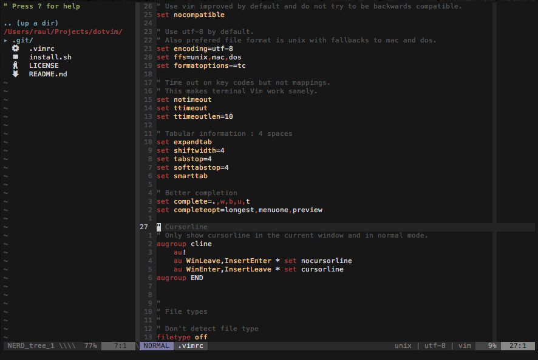

# dotvim

My current vim configuration:

## Features

This configuration features the following plugins:

* [base16-vim](https://github.com/chriskempson/base16-vim) colorscheme.
* [lightline](https://github.com/itchyny/lightline.vim) and [vim-base16-lightline](https://github.com/daviesjamie/vim-base16-lightline) for the status and tab line.
* [nedtree](https://github.com/scrooloose/nerdtree) file browser.
* [vim-devicons](https://github.com/ryanoasis/vim-devicons) for file-type icons on NerdTree.
* [ctrl-p](https://github.com/kien/ctrlp.vim) for searching files.
* [youcompleteme](https://github.com/Valloric/YouCompleteMe) and [supertab](https://github.com/ervandew/supertab) for completion.

Everthing is managed with Vundle.

Also there is sytanx and language plugins for Golang, Javascript, Markdown and Python.

## Installation

Just clone and execute `install.sh`